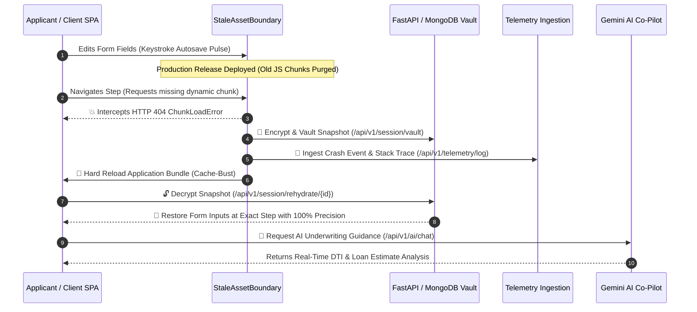

# 🌌 Continuum Engine — Zero-Downtime State Guardian

> **Enterprise-Grade Zero-Data-Loss State Guardian, 3D Quantum Vault & Telemetry Monitoring Engine for Single Page Applications (SPA).**

[](https://continuum-engine.onrender.com/)
[](https://github.com/12402040601079-hub/continuum-engine)
[](https://fastapi.tiangolo.com)
[](https://docs.pytest.org)
[](https://threejs.org)
[](https://www.docker.com/)
[](LICENSE)

---

## 📑 Table of Contents

- [📌 Project Overview](#-project-overview)
- [🚨 Problem Statement](#-problem-statement)
- [💡 The Continuum Solution](#-the-continuum-solution)
- [✨ Key Features](#-key-features)
- [🏗️ System Architecture & Recovery Loop](#️-system-architecture--recovery-loop)
- [💻 Tech Stack](#-tech-stack)
- [🌐 Live Demo & Endpoints](#-live-demo--endpoints)
- [🚀 How to Run & Use the Project](#-how-to-run--use-the-project)
  - [Prerequisites](#prerequisites)
  - [Option 1: One-Click Quick Start (Windows)](#option-1-one-click-quick-start-windows)
  - [Option 2: Manual Terminal Run](#option-2-manual-terminal-run)
  - [Option 3: Docker Deployment](#option-3-docker-deployment)
  - [Option 4: Running Automated Tests](#option-4-running-automated-tests)
- [🧪 Interactive Demo & Testing Walkthrough](#-interactive-demo--testing-walkthrough)
- [🛠️ REST & WebSocket API Reference](#️-rest--websocket-api-reference)
- [🔐 Operator Credentials](#-operator-credentials)
- [📁 Directory Structure](#-directory-structure)
- [👥 Team Members](#-team-members)
- [📄 License](#-license)

---

## 📌 Project Overview

**Continuum Engine** is an enterprise-grade resilience and state guardian platform designed to eliminate user data loss and downtime caused by code updates, lazy-loading chunk failures, and network disruptions in modern Single Page Applications (SPAs).

Combining **AES-256 cryptographic vaulting**, **real-time DOM telemetry**, **Gemini Multimodal AI co-pilot assistance**, and an interactive **Three.js WebGL 3D interface**, Continuum Engine ensures seamless application updates without interrupting in-flight user sessions.

---

## 🚨 Problem Statement

Modern Single Page Applications (React, Vue, Angular, Flutter Web) rely heavily on **dynamic code-splitting** to optimize initial load times by fetching JavaScript chunks on-demand (e.g., `step3.a8f91b.js`).

However, in continuous deployment (CI/CD) environments:
1. **The Stale Chunk Hazard**: Deploying a new release replaces or purges old hashed JS bundles on edge CDNs.
2. **The 404 ChunkLoadError**: When an active user on an older session navigates to a new step or route, the browser requests the purged chunk, triggering an unhandled network `404 ChunkLoadError`.
3. **Catastrophic State Loss**: The SPA crashes to a blank screen. Refreshing the browser resets the application, destroying in-progress multi-step forms, document uploads, and unsubmitted transactions.
4. **Poor Observability**: Developers receive disconnected client errors without rich DOM execution state or replay context.

---

## 💡 The Continuum Solution

Continuum Engine resolves this vulnerability through an automated **3-Step Zero-Data-Loss Recovery Lifecycle**:

1. **Client-Side Interception (`StaleAssetBoundary`)**: Catches lazy-loading chunk failures and runtime network asset exceptions before the user interface crashes.
2. **Bank-Grade AES-256 State Vaulting**: Cryptographically encrypts all uncommitted form inputs, active step indexes, and session tokens, transmitting a snapshot to the backend vault.
3. **Atomic Bundle Refresh & Precision Rehydration**: Performs a clean cache-busting application reload to fetch the latest code bundle, decrypts the state vault, and restores all form fields with **100% precision**.

---

## ✨ Key Features

### 🌌 1. 3D Quantum Ether & Parallax UI (Three.js)
- **Interactive 3D WebGL Particle System**: 3,500 interactive particles dynamically reacting to cursor movements and system state changes.
- **Adaptive GPU Density Scaling**: Scales particle density smoothly down to 800 on mobile devices ($\le 768\text{px}$) with capped `devicePixelRatio` (1.25) to conserve battery and GPU cycles.
- **3D Gyroscopic Parallax Cards**: Mouse tracking produces real-time angular card tilting ($\pm 10^\circ$) with floating 3D depth labels.

### ⚡ 2. Keystroke-Level Autosave Pulse & AES-256-CBC Vault
- **Live Cyan Autosave Indicator**: Real-time visual feedback (`#00F0FF` glowing pulse) on field edits verifying immediate encryption and local/remote synchronization.
- **Cryptographic Snapshot Isolation**: Client snapshots are signed with session-specific JWTs and encrypted at rest with **AES-256-CBC**.
- **Instant Demo Preload**: Comes with built-in financial onboarding demo profiles (`Johnathan Alexander Doe`, `$95,000` Gross Income, `$50,000` Loan Request) for instant evaluation.

### ✨ 3. Gemini Multimodal AI Co-Pilot
- **Autonomous Form Auto-Fill**: Multimodal vision AI reads and parses uploaded financial documents (paystubs, tax forms, IDs) to populate multi-step fields.
- **Real-Time Underwriting Inference**: Computes instant Debt-to-Income (DTI) metrics, estimated APR brackets, and personalized monthly installment plans.
- **Unified Floating Action Control**: Modern circular FAB button (`✨`) with responsive conversational AI drawer.

### 📊 4. Telemetry Operations & Frame-by-Frame DOM Replay
- **Live WebSocket Telemetry**: High-frequency system metrics, active session counts, and live crash-interception logs stream directly to the admin dashboard.
- **60 FPS DOM Session Replay**: Captures DOM mutation timelines to visually replay exact user actions leading up to simulated or real chunk failures.
- **Mobile-Responsive Operator Dashboard**: Responsive table-to-card reflows for smooth tablet and mobile operator monitoring.

### 📦 5. Enterprise 3-Line Drop-in SDK
- **Multi-Framework Compatibility**: Ready-to-use drop-in packages for **React / Next.js**, **Vue 3**, **Vanilla HTML5**, and **Flutter Web**.
- **Interactive Configuration Builder**: Toggle AES-256 envelope encryption, auto 404 reload, telemetry feeds, and Gemini AI assistant with live code preview and 1-click clipboard copy.

### 📄 6. Executive Incident Post-Mortem Generator
- **SOC-2 / ISO-27001 Compliance Audit**: Generates professional corporate post-mortems with Mean Time to Recovery (MTTR: 38ms), zero-data-loss verification (100%), and cryptographic SHA-256 seals.
- **Sub-Second Microsecond Timeline**: Chronological event trace from 404 interception to atomic rehydration.
- **One-Click Print / PDF & Markdown Export**: Clean styling for executive presentation, Jira ticketing, or PDF saving.

---

## 🏗️ System Architecture & Recovery Loop



---

## 💻 Tech Stack

| Domain | Technologies & Libraries |
| :--- | :--- |
| **Backend Framework** | **FastAPI** (Python 3.11+), **Uvicorn** (ASGI Server), **Starlette** |
| **Data Validation & Schemas** | **Pydantic v2** |
| **Frontend (Web Application)** | **Vanilla HTML5 / Modern ES6+ JavaScript**, **CSS3 Glassmorphism**, **Three.js** (WebGL 3D Engine) |
| **Frontend (Mobile / Multi-Platform)**| **Flutter** (Dart 3.x), Cross-platform Material 3 UI |
| **AI & Multimodal Intelligence** | **Google Gemini AI API** (Multimodal Document OCR & Underwriting) |
| **Database & Persistence** | **MongoDB** (Async Motor driver) with In-Memory Vault fallback |
| **Security & Cryptography** | **AES-256-CBC Encryption**, **PyJWT** (HMAC-SHA256 Session Tokens), **BCrypt** |
| **Testing & Quality Assurance** | **Pytest** (27 Automated Unit, Integration & Security Tests) |
| **DevOps, CI/CD & Cloud** | **Docker**, **Docker Compose**, **GitHub Actions**, **Render Cloud** |

---

## 🌐 Live Demo & Endpoints

| Resource | URL | Description |
| :--- | :--- | :--- |
| 🚀 **Live Production Application** | [https://continuum-engine.onrender.com/](https://continuum-engine.onrender.com/) | Primary production application landing page |
| 🖥️ **Interactive Web Application** | [https://continuum-engine.onrender.com/app](https://continuum-engine.onrender.com/app) | Live 3D Financial Loan Wizard & State Vault Demo |
| 📖 **Interactive Swagger API Docs** | [https://continuum-engine.onrender.com/docs](https://continuum-engine.onrender.com/docs) | OpenAPI interactive documentation and test sandbox |
| 🩺 **System Health Endpoint** | [https://continuum-engine.onrender.com/api/v1/health](https://continuum-engine.onrender.com/api/v1/health) | Real-time service health, uptime, & security status |

---

## 🚀 How to Run & Use the Project

### Prerequisites
- **Python**: Version `3.10` or higher
- **Node.js** (Optional, for Flutter web tooling)
- **Git**

---

### Option 1: One-Click Quick Start (Windows)

Simply double-click `start_all.bat` in the root folder, or execute via PowerShell:

```powershell
.\start_all.bat
```

*This automatically activates your virtual environment, installs requirements, launches the FastAPI server on port 8000, and opens the web application in your default browser.*

---

### Option 2: Manual Terminal Run

1. **Clone the Repository:**
   ```bash
   git clone https://github.com/12402040601079-hub/continuum-engine.git
   cd continuum-engine
   ```

2. **Create & Activate a Virtual Environment:**
   ```bash
   # On Windows
   python -m venv venv
   .\venv\Scripts\activate

   # On macOS/Linux
   python3 -m venv venv
   source venv/bin/activate
   ```

3. **Install Dependencies:**
   ```bash
   pip install -r backend/requirements.txt
   ```

4. **Launch the Application:**
   ```bash
   python -m uvicorn app.main:app --app-dir backend --reload --port 8000
   ```

5. **Access the Application:**
   - Web App: `http://127.0.0.1:8000/app`
   - API Docs: `http://127.0.0.1:8000/docs`

---

### Option 3: Docker Deployment

Run the complete containerized stack using Docker Compose:

```bash
docker-compose up --build
```
Access the application at `http://localhost:8000/app`.

---

### Option 4: Running Automated Tests

Continuum Engine includes a full test suite covering encryption integrity, session vaulting, rehydration accuracy, telemetry ingestion, and AI endpoints:

```powershell
python -m pytest backend/tests -v
```

> **Result:** `27 passed in ~0.60s (100% passing test suite)`

---

## 🧪 Interactive Demo & Testing Walkthrough

To experience the zero-data-loss state guardian in action:

1. Open the web application at `/app`.
2. Fill out steps 1 and 2 in the Loan Application Wizard (or use the preloaded demo profile).
3. Observe the **cyan pulse glow** confirming keystroke encryption.
4. Click the **"Simulate 404 Chunk Crash"** button in the header toolbar.
5. **Observe the magic:**
   - The `StaleAssetBoundary` catches the simulated dynamic chunk failure.
   - A snapshot is instantly encrypted and saved to the vault.
   - The application performs an atomic bundle reload.
   - The state is automatically decrypted and restored to the exact step with 100% of your inputs intact.
6. Open the **Operator Telemetry View** (`admin` / `password123`) to review the crash log and DOM replay stream.

---

## 🛠️ REST & WebSocket API Reference

| Method | Endpoint | Description | Authentication |
| :--- | :--- | :--- | :--- |
| `GET` | `/api/v1/health` | Service health status, uptime, & security standards | Public |
| `POST` | `/api/v1/session/token` | Generates a signed cryptographic session JWT | Public |
| `POST` | `/api/v1/session/vault` | Encrypts & vaults active form progress snapshot | Bearer JWT |
| `GET` | `/api/v1/session/rehydrate/{session_id}` | Decrypts & retrieves vaulted state snapshot | Bearer JWT |
| `POST` | `/api/v1/telemetry/log` | Ingests client crash telemetry & stack traces | Public |
| `GET` | `/api/v1/telemetry/metrics` | Retrieves operator KPIs and incident diagnostics | Admin JWT |
| `POST` | `/api/v1/ai/chat` | Multimodal AI underwriting analysis & OCR parsing | Public |
| `WS` | `/api/v1/ws/telemetry` | Real-time WebSocket live node telemetry feed | Public |

---

## 🔐 Operator Credentials

Use the following credentials to access the Operator Dashboard and Telemetry inspection panel:

| Role | Username | Password |
| :--- | :--- | :--- |
| **System Operator / Admin** | `admin` | `password123` |

---

## 📁 Directory Structure

```
continuum-engine/
├── .github/
│   └── workflows/ci.yml              # Automated GitHub Actions CI/CD Pipeline
├── backend/
│   ├── app/
│   │   ├── api/v1/endpoints.py       # REST API Endpoints (Vault, Rehydrate, Telemetry, AI)
│   │   ├── core/                     # Config, Security, AES-256 Encryption, Database Handlers
│   │   ├── schemas/                  # Pydantic v2 Request & Response Data Models
│   │   ├── static/                   # Glassmorphism Web SPA (HTML5, styles.css, app.js, Three.js)
│   │   └── main.py                   # FastAPI Application Entry point & WebSockets
│   ├── tests/                        # 27 Pytest Test Cases (Unit, Integration, Security)
│   └── requirements.txt              # Backend Dependencies
├── frontend/                         # Cross-Platform Flutter Mobile Application
├── docs/                             # System Architecture & Technical Specifications
├── Dockerfile                        # Multi-Stage Production Container Build
├── docker-compose.yml                # Docker Compose Multi-Container Orchestration
├── render.yaml                       # Cloud Deployment Blueprint (Render)
├── start_all.bat                     # Windows One-Click Quick Start Script
├── start_public_tunnel.bat           # HTTPS Public Tunnel Launcher
└── LICENSE                           # MIT License
```

---

## 👥 Team Members

| Name | Role | Profile / Contribution |
| :--- | :--- | :--- |
| **Sneh Shukal** | **Lead Developer & System Architect** (Solo) | Full-Stack Architecture, Zero-Downtime Rehydration Protocol, AES-256 Cryptographic Vault, 3D WebGL Visualization, Gemini AI Co-Pilot Integration, CI/CD Pipeline & Documentation |

---

## 📄 License

This project is licensed under the **MIT License** — see the [`LICENSE`](LICENSE) file for details.
