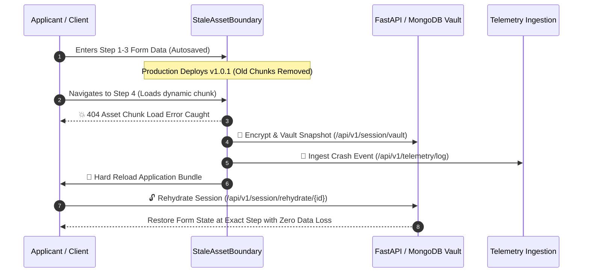

# ⚡ Continuum Engine

> **Zero-Data-Loss State Guardian & Telemetry Monitoring Engine for Single Page Applications (SPA).**

Continuum Engine eliminates **Stale Client Asset / Chunk Load 404 Errors** during continuous frontend deployments. When a production deployment invalidates old code-split JavaScript chunks, Continuum Engine intercepts the network 404 failure, vaults active form progress (with bank-grade AES-256 encryption at rest), triggers a hot bundle refresh, and seamlessly rehydrates user inputs with zero data loss.

---

## 🌟 Key Features

1. **4-Step Resilient Form Wizard**:
   - **Step 1:** Personal Profile & Identity Validation.
   - **Step 2:** Financial Details & Gross Income Stream.
   - **Step 3:** Dynamic Loan Configuration & Repayment Terms.
   - **Step 4:** Summary Review, Consent Check, and Underwriting Submission.
2. **Real-time State Vaulting & Zero Data Loss**:
   - Continuous debounced autosave on keystrokes to persistent local cache and backend vault.
   - Bank-grade **AES-256 CBC encryption** of form inputs before database storage.
   - Instant rehydration upon page load, version update, or browser restart.
3. **Stale Asset Boundary & 404 Interceptor**:
   - Intercepts dynamic chunk asset loading errors (`main.part.js`).
   - Executes multi-step recovery flow with animated user feedback.
   - Dispatches crash logs to the ingestion pipeline before reloading the application.
4. **Telemetry & Operations Dashboard**:
   - Role-based JWT security for Operators (`admin` / `password123`).
   - Real-time KPI monitoring: Crash incidents, version drift count, impacted sessions.
   - Detailed crash logs with stack trace inspector modal.
5. **Dual Frontend Options**:
   - **Embedded Web SPA:** Native HTML5, CSS3 Glassmorphism, 3D Canvas Reactor, and Vanilla JavaScript app served directly by FastAPI.
   - **Flutter Web App:** Production-ready Flutter frontend with Provider state management and `ContinuumGuard` service.
6. **Instant Global Access & Cloud Ready**:
   - Built-in Dockerfile, Docker Compose, Render blueprint (`render.yaml`), and 1-Click Instant Public Tunnel (`start_public_tunnel.bat`).

---

## 🏗️ Architecture Overview



---

## 🌐 Public Deployment & Access

### Option A: Instant Public Access via Global Tunnel (Zero Setup)
To instantly expose your running local instance to anyone in the world over a secure HTTPS public URL:
```bat
start_public_tunnel.bat
```
This generates a public link accessible from any smartphone, tablet, or PC worldwide.

### Option B: Deploy to Cloud Free (Render / Railway / Fly.io)
1. **Render**:
   - Link your GitHub repository [`12402040601079-hub/continuum-engine`](https://github.com/12402040601079-hub/continuum-engine).
   - Render automatically detects `render.yaml` and deploys the container with zero configuration.
2. **Docker / Docker Compose**:
   ```bash
   docker-compose up --build -d
   ```
   Access at `http://localhost:8000/app`.

3. **Pre-built GitHub Container Registry (GHCR) Image**:
   ```bash
   docker pull ghcr.io/12402040601079-hub/continuum-engine:latest
   docker run -p 8000:8000 ghcr.io/12402040601079-hub/continuum-engine:latest
   ```

---

## 🚀 Local Quick Start & Running

### 1. One-Click Launcher
Double-click `start_all.bat` or run:
```bat
start_all.bat
```
This will:
- Start the FastAPI backend server on `http://127.0.0.1:8000`.
- Automatically open the interactive Web SPA in your default browser at `http://127.0.0.1:8000/app`.
- Attempt to start the Flutter frontend if the Flutter SDK is installed.

### 2. Manual Backend Startup
```powershell
python -m uvicorn app.main:app --app-dir backend --reload --port 8000
```
- **Web Application:** [http://127.0.0.1:8000/app](http://127.0.0.1:8000/app)
- **Interactive API Docs (Swagger):** [http://127.0.0.1:8000/docs](http://127.0.0.1:8000/docs)
- **Health Check Endpoint:** [http://127.0.0.1:8000/api/v1/health](http://127.0.0.1:8000/api/v1/health)

### 3. Run Automated Tests
```powershell
python -m pytest
```
*Executes all 17 automated integration & unit tests.*

---

## 📊 Telemetry Operator Credentials

| Role | Username | Password |
| :--- | :--- | :--- |
| **System Operator / Admin** | `admin` | `password123` |

---

## 📁 Repository Structure

```
├── .github/workflows/
│   └── deploy.yml                    # Automated CI/CD (Pytest + GHCR Docker Publish)
├── backend/
│   ├── app/
│   │   ├── api/v1/endpoints.py       # REST API Endpoints (Vault, Rehydrate, Telemetry, Health)
│   │   ├── core/                     # Config, Security, Encryption, Mock/Motor DB
│   │   ├── schemas/                  # Pydantic Schemas & Request/Response Models
│   │   ├── static/                   # Glassmorphic Web SPA (index.html, styles.css, app.js, 3D, PWA)
│   │   └── main.py                   # FastAPI Application Entry, WebSockets & Static Mounts
│   ├── scripts/init_db.py            # MongoDB Schema Initialization & Indexes
│   ├── tests/                        # Comprehensive Pytest Suite (17 Test Cases)
│   └── requirements.txt
├── frontend/
│   ├── lib/
│   │   ├── services/continuum_guard.dart   # Flutter Continuum Guard Service
│   │   └── main.dart                       # Flutter 4-Step Wizard & Operator Dashboard
│   └── pubspec.yaml
├── docs/                             # Requirements, UI, and Database Specifications
├── Dockerfile                        # Multi-stage production container
├── docker-compose.yml                # Production Docker stack with MongoDB
├── render.yaml                       # 1-Click Render Cloud deployment blueprint
├── pytest.ini                        # Pytest configuration
├── start_all.bat                     # One-click launcher
├── start_public_tunnel.bat           # Instant public internet URL tunnel
└── setup_and_run_frontend.ps1        # Automated Flutter SDK installer & runner
```
