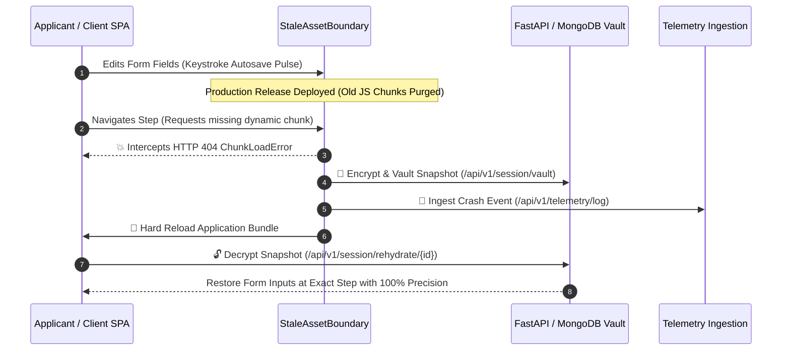

# 🌌 Continuum Engine — Zero-Downtime State Guardian

> **Enterprise-Grade Zero-Data-Loss State Guardian, 3D Quantum Vault & Telemetry Monitoring Engine for Single Page Applications (SPA).**

[](https://continuum-engine.onrender.com/)
[](https://github.com/12402040601079-hub/continuum-engine)
[](https://fastapi.tiangolo.com)
[](https://docs.pytest.org)
[](https://threejs.org)

---

## 🌐 Live Production Application
🔗 **Render Production Deployment:** [https://continuum-engine.onrender.com/](https://continuum-engine.onrender.com/)  
🔗 **Web Interface:** [https://continuum-engine.onrender.com/app](https://continuum-engine.onrender.com/app)  
🔗 **Interactive Swagger API Docs:** [https://continuum-engine.onrender.com/docs](https://continuum-engine.onrender.com/docs)  
🔗 **API Health Check:** [https://continuum-engine.onrender.com/api/v1/health](https://continuum-engine.onrender.com/api/v1/health)  

---

## 💡 What is Continuum Engine?

Modern Single Page Applications (SPAs) use code-splitting to lazy-load JavaScript chunks (`step3.a8f91b.js`). When a new production release is deployed, older chunks are purged from CDNs. When an active user navigates to a new page or wizard step, their browser attempts to fetch the deleted chunk, resulting in a **404 ChunkLoadError**, causing a blank screen and destroying unsubmitted user data.

**Continuum Engine guarantees Zero Data Loss and Zero Downtime:**
1. **Intercepts 404 Chunk Load Errors**: Catches network asset failures before the application crashes.
2. **AES-256 Cryptographic Vaulting**: Serializes and encrypts in-flight form data and step state to a MongoDB backend.
3. **Automated Bundle Refresh & Rehydration**: Hot-reloads the application to fetch fresh production code and rehydrates user inputs with **100% field precision**.

---

## 🎨 Key Features & Architecture

### 🌌 1. 3D Animated & Dream Fantasy Layout (Quantum Ether)
- **Three.js WebGL Particle Mesh (`z-index: 0`)**: Interactive 3D particle canvas with dual-axis rotation.
- **Adaptive Mobile GPU Density Scaling**: Automatically scales particle density from **3,500** on desktop down to **800** on mobile viewports ($\le 768\text{px}$) with `devicePixelRatio` capped at **1.25** to preserve GPU performance and battery life.
- **3D Parallax Input Cards (`.input-3d-card`)**: Mousemove tracking tilts input fields up to **$\pm 10^\circ$** with floating 3D labels (`translateZ(15px)`).

### ⚡ 2. Keystroke-Level Autosave Pulse & AES-256 Security
- **Cyan Pulse Feedback (`#00F0FF`)**: Typing in any wizard input field triggers an instant cyan border glow (`.autosave-pulsing`), confirming that inputs are encrypted via bank-grade **AES-256-CBC** at rest.
- **Pre-Loaded Demonstration Data**: Pre-configured with working applicant data (`Johnathan Alexander Doe`, Gross Income `$95,000`, Loan Request `$50,000`) so first-time reviewers can immediately interact with the system.

### ✨ 3. Gemini AI Co-Pilot Assistant
- **Single Circular FAB Button (`✨`)**: Sleek, circular floating action button at the bottom-right corner.
- **Multimodal OCR Vision**: Scans paystubs and government IDs to auto-fill financial wizard steps.
- **Real-Time Underwriting Inference**: Calculates Debt-to-Income (DTI), APR estimates, and projected monthly installments.

### 📊 4. Telemetry Operations & Incident Diagnostics
- **Operator Dashboard**: Role-based JWT security for Operators (`admin` / `password123`).
- **60 FPS DOM Mutation Session Replay**: Replays incident diagnostic stack traces frame-by-frame.
- **Stacked Mobile Data Cards**: Data tables automatically transform into stacked touch cards on screens $\le 768\text{px}$.

---

## 🏗️ 3-Step Zero-Data-Loss Recovery Loop



---

## 🛠️ REST API Endpoints Overview

| Method | Endpoint | Description | Auth |
| :--- | :--- | :--- | :--- |
| `GET` | `/api/v1/health` | System health check, uptime, & security standards | Public |
| `POST` | `/api/v1/session/token` | Generates cryptographic session JWT token | Public |
| `POST` | `/api/v1/session/vault` | Encrypts & vaults active form progress | Bearer JWT |
| `GET` | `/api/v1/session/rehydrate/{id}` | Decrypts & retrieves vaulted state snapshot | Bearer JWT |
| `POST` | `/api/v1/telemetry/log` | Ingests client crash telemetry & stack traces | Public |
| `GET` | `/api/v1/telemetry/metrics` | Retrieves operator KPI metrics & incident logs | Admin JWT |
| `POST` | `/api/v1/ai/chat` | Queries Gemini AI Multimodal Co-Pilot | Public |
| `WS` | `/api/v1/ws/telemetry` | High-frequency live WebSocket node metric telemetry stream | Public |

---

## 🚀 Local Quick Start & Running

### 1. One-Click Launcher (Windows)
Double-click `start_all.bat` or run:
```powershell
.\start_all.bat
```
Launches the FastAPI backend on `http://127.0.0.1:8000` and opens the web application at `http://127.0.0.1:8000/app`.

### 2. Manual Command Line
```powershell
python -m uvicorn app.main:app --app-dir backend --reload --port 8000
```

### 3. Automated Test Verification
```powershell
python -m pytest backend/tests
```
*Executes all 27 automated unit, integration, and mock database tests (100% Passing).*

---

## 🔐 Operator Credentials

| Role | Username | Password |
| :--- | :--- | :--- |
| **System Operator / Admin** | `admin` | `password123` |

---

## 📁 Repository Architecture

```
├── backend/
│   ├── app/
│   │   ├── api/v1/endpoints.py       # REST API Endpoints (Vault, Rehydrate, Telemetry, AI)
│   │   ├── core/                     # Config, Security, AES-256 Encryption, MongoDB/Mock DB
│   │   ├── schemas/                  # Pydantic v2 Request & Response Models
│   │   ├── static/                   # Glassmorphism Web SPA (index.html, styles.css, app.js, Three.js)
│   │   └── main.py                   # FastAPI Application Entry point & WebSockets
│   └── tests/                        # 27 Automated Pytest Test Cases
├── frontend/                         # Cross-platform Flutter App Codebase
├── docs/                             # System Architecture Specifications
├── Dockerfile                        # Multi-stage production container build
├── docker-compose.yml                # Docker stack configuration
├── render.yaml                       # Render cloud deployment blueprint
├── start_all.bat                     # One-click launcher script
└── start_public_tunnel.bat           # Global HTTPS public tunnel script
```

---

## 📄 License

Distributed under the **MIT License**. See [`LICENSE`](LICENSE) for details.
