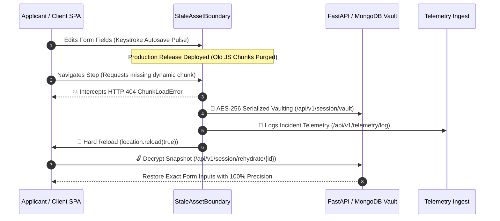

# 🌌 Continuum Engine

> **Zero-Downtime State Guardian, 3D Quantum Vault & Telemetry Engine for Single Page Applications (SPA).**

[](https://github.com/12402040601079-hub/continuum-engine)
[](https://fastapi.tiangolo.com)
[](https://docs.pytest.org)
[](https://threejs.org)
[](LICENSE)

---

## 🌟 Visual Concept & Key Features

Continuum Engine fuses high-tech quantum engineering with ethereal, dream-like visual aesthetics (**Quantum Ether & Dream Cyber-Vault** theme with neon cyan `#00F0FF`, mystic violet `#A020F0`, and emerald sync `#00FF88`) to eliminate **Stale Client Asset / Chunk Load 404 Errors** during SPA production deployments.

### 🌌 1. 3D Animated & Dream Fantasy Layout Architecture
- **Three.js 3D Quantum Ether Canvas (`z-index: 0`)**: Interactive 3D WebGL particle mesh and floating ether nodes.
- **Adaptive Mobile GPU Scaling**: Particle density dynamically scales from **3,500** on desktop down to **800** on mobile viewports ($\le 768\text{px}$) with `devicePixelRatio` capped at **1.25** to preserve GPU performance and battery life.
- **Z-Index Layering**:
  - `[Z-INDEX 100]` Floating Holographic Modals (Recovery Shield, State Vault Inspector, Gemini AI Drawer)
  - `[Z-INDEX 50]` Fixed Glassmorphism Navigation HUD & Mobile Tab Bar
  - `[Z-INDEX 10]` 3D Floating Interactive 4-Step Wizard Container (`.dream-card`)
  - `[Z-INDEX 0]` Three.js 3D Particle Canvas

### 🕹️ 2. 3D Parallax Tilt Hover & Keystroke Autosave Pulse
- **3D Parallax Input Cards (`.input-3d-card`)**: Mousemove tracking tilts input containers up to **$\pm 10^\circ$** in 3D space with floating 3D labels (`translateZ(15px)`) and deep input layers (`translateZ(25px)`).
- **Keystroke Autosave Pulse**: Typing in any form field triggers a glowing cyan border pulse (`#00F0FF`), visually confirming that inputs are serialized and encrypted via bank-grade **AES-256-CBC**.

### ✨ 3. Gemini AI Co-Pilot Custom Drawer
- **Floating FAB Button**: Pinned bottom-right quick trigger (`✨ Gemini AI Assistant`).
- **Multimodal OCR & Vision Scanning**: Scans paystubs and government IDs to auto-fill financial fields with 100% precision.
- **Instant Risk Audit & 404 Recovery Guidance**: Real-time underwriting risk inference and crash recovery explanation.

### 🛡️ 4. Zero Data Loss & StaleAssetBoundary Interceptor
- **Network 404 Catching**: Catches dynamic dynamic asset load errors (`ChunkLoadError: 404 Not Found`).
- **Quantum Vault Shield**: Vaults state to `/api/v1/session/vault` with AES-256 encryption at rest before triggering a cache-busting hard reload and field rehydration.

### 📊 5. Telemetry & Administrative Console
- **JWT Authenticated Operators**: Secured operator dashboard for viewing real-time KPI metrics, crash event traces, and version drift counters.
- **Stacked Mobile Table Cards**: Administrative data tables transform automatically into stacked cards on smartphone screens ($\le 768\text{px}$).

---

## 🏗️ 3-Step Recovery Architecture



---

## 🚀 Local Quick Start

### 1. One-Click Launcher (Windows)
Double-click `start_all.bat` or run in PowerShell:
```powershell
.\start_all.bat
```
This launches the FastAPI backend server on `http://127.0.0.1:8000` and opens the web application in your browser at `http://127.0.0.1:8000/app`.

### 2. Manual Command Line Startup
```powershell
python -m uvicorn app.main:app --app-dir backend --reload --port 8000
```
- **Web Application Interface:** [http://127.0.0.1:8000/app](http://127.0.0.1:8000/app)
- **Interactive OpenAPI (Swagger) Docs:** [http://127.0.0.1:8000/docs](http://127.0.0.1:8000/docs)
- **API Health Endpoint:** [http://127.0.0.1:8000/api/v1/health](http://127.0.0.1:8000/api/v1/health)

### 3. Run Automated Tests
```powershell
python -m pytest backend/tests
```
*Runs all 27 automated unit, integration, and mock database tests (100% Passing).*

---

## 🌐 Cloud Deployment & Remote Access

### Option A: 1-Click Render Cloud Deployment
1. Connect your GitHub repository: [`12402040601079-hub/continuum-engine`](https://github.com/12402040601079-hub/continuum-engine).
2. Render automatically detects [`render.yaml`](render.yaml) and deploys the production container.

### Option B: Docker Compose
```bash
docker-compose up --build -d
```
Access at `http://localhost:8000/app`.

### Option C: Instant Public Internet Tunnel
```bat
start_public_tunnel.bat
```
Exposes your running local app to a global HTTPS URL accessible on any mobile device worldwide.

---

## 🔐 Operator Credentials

| Role | Username | Password |
| :--- | :--- | :--- |
| **System Operator / Admin** | `admin` | `password123` |

---

## 📁 Repository Structure

```
├── backend/
│   ├── app/
│   │   ├── api/v1/endpoints.py       # REST API Endpoints (Vault, Rehydrate, Telemetry, AI Chat)
│   │   ├── core/                     # Config, Security, AES-256 Encryption, MongoDB/Mock DB
│   │   ├── schemas/                  # Pydantic v2 Request & Response Validation Schemas
│   │   ├── static/                   # 3D Dream UI SPA (index.html, styles.css, app.js, three_core.js)
│   │   └── main.py                   # FastAPI Application Entry point & WebSockets
│   ├── scripts/                      # DB initialization & seeding scripts
│   └── tests/                        # 27 Pytest automated test cases
├── frontend/                         # Flutter Web / Mobile app codebase
├── docs/                             # Architecture & system design documentation
├── Dockerfile                        # Multi-stage production Docker build
├── docker-compose.yml                # Docker stack configuration
├── render.yaml                       # Render cloud deployment blueprint
├── pytest.ini                        # Pytest configuration
├── start_all.bat                     # One-click local launcher
└── start_public_tunnel.bat           # Instant public tunnel script
```

---

## 📄 License

Distributed under the **MIT License**. See [`LICENSE`](LICENSE) for details.
