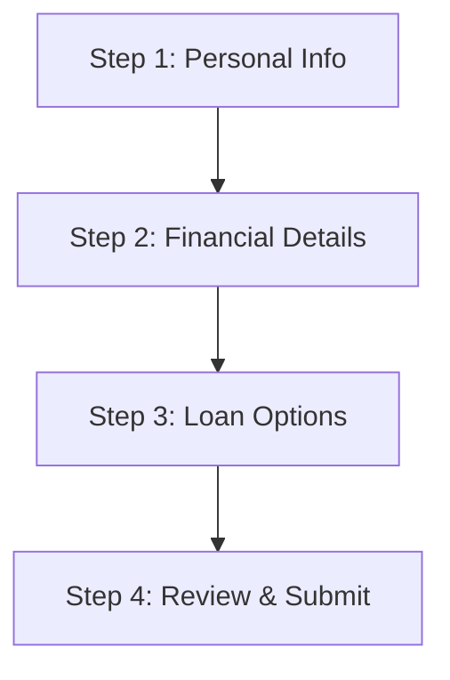

# Continuum Engine - Requirements Specification

## 1. Overview
The **Continuum Engine** is an enterprise-grade system designed to eliminate "Stale Client Asset" / "Chunk Load 404 Errors" during Single Page Application (SPA) deployments. It guarantees zero user data loss by intercepting asset loading failures, vaulting active session state to a secure backend, reloading the application to pull the latest production assets, and seamlessly rehydrating the user's progress.

---

## 2. Functional Specifications

### 2.1. Client Version Detection & Drift Management
- **Static Version Registry:** The backend exposes a `/version/check` endpoint returning the active production version.
- **Client Polling & Headers:** The client checks the active version periodically or compares its running version header against incoming API response headers.
- **Drift Identification:** If the client running version does not match the active production version, the engine marks the client as "drifted".

### 2.2. Telemetry System & Chunk Load 404 Tracking
- **Error Interception:** A global error handler/boundary captures network failure events specifically matching dynamic asset chunk loads (e.g., HTTP status code `404` for script/style assets).
- **Log Ingestion:** Telemetry events containing client version, targeted asset URL, browser user-agent, timestamp, and user session ID are transmitted to the backend `/telemetry/log` endpoint.
- **Dashboard Reporting:** Aggregated metrics show version drift counts and crash rates.

### 2.3. Session Snapshot Vaulting & Rehydration
- **Automatic State Capture:** Form inputs and wizard progress are automatically serialized to a local snapshot on every input change or page transition.
- **Offline Fallback:** If the network is unavailable, state snapshots are stored in offline persistent storage (e.g., Hive/SharedPreferences).
- **Backend Vaulting:** When a 404 chunk load error is intercepted, the active state is instantly vaulted to the backend `/session/vault` endpoint before reloading the page.
- **State Rehydration:** Upon page reload, the client detects an interrupted session, fetches the snapshot from `/session/rehydrate`, maps it to the UI, and restores the user to their exact place.

### 2.4. Schema-Drift State Migration
- **Transformation Rules:** When rehydrating state from a different version, the client or backend runs transformation rules to map obsolete schema keys to new schema layouts, preventing application crashes.

---

## 3. Non-Functional Specifications

### 3.1. Reliability & Data Safety
- **Zero Data Loss:** Under no circumstances should unsubmitted user input be lost due to asset version updates.
- **Transactional Vaulting:** Snapshots must write reliably. Partial writes should fail gracefully without corrupting the previous state.

### 3.2. Performance
- **Sub-Second Latency:** Vaulting requests must complete in less than 500ms under standard network conditions to prevent user-perceived lag during recovery.
- **Minimal Telemetry Overhead:** Telemetry logs should be buffered or sent asynchronously to avoid blocking user interactions.

### 3.3. Security & Access Control
- **Data Encryption:** Session snapshots containing Personally Identifiable Information (PII) must be encrypted in transit using HTTPS and at rest within the MongoDB instance.
- **Authentication:** Telemetry metrics and session rehydration require secure JWT token verification.
- **Session Ownership:** Session snapshots must belong to authenticated/validated users or uniquely generated secure session tokens.

---

## 4. User Roles

### 4.1. Applicant (End-User)
- Fills out the multi-step forms.
- Interacts with the frontend interface.
- Expects a seamless wizard experience even during application redeployments.

### 4.2. Telemetry Operator / Operations Engineer
- Monitors deployment health via telemetry metrics.
- Tracks chunk load failure frequencies and version drift patterns.

### 4.3. System Administrator
- Configures version headers, API timeouts, and state retention/TTL values.

---

## 5. Sample Scenario: 4-Step Bank Loan Application

To demonstrate the state recovery engine, we define a 4-step Bank Loan Application form.

### Step 1: Personal Information
- **Fields:**
  - `fullName` (String, Required)
  - `dateOfBirth` (String, Format: YYYY-MM-DD, Required)
  - `email` (String, Email Format, Required)
  - `phoneNumber` (String, Required)
  - `ssn` (String, Secure Format, Required)

### Step 2: Financial Details
- **Fields:**
  - `employmentStatus` (Enum: Employed, Self-Employed, Unemployed, Retired)
  - `annualIncome` (Double, Minimum: 0, Required)
  - `monthlyDebt` (Double, Minimum: 0, Required)

### Step 3: Loan Options
- **Fields:**
  - `loanAmount` (Double, Range: $1,000 - $10,000,000, Required)
  - `repaymentTerm` (Integer, Months: 12, 24, 36, 48, 60, Required)
  - `loanPurpose` (Enum: Debt Consolidation, Home Improvement, Business, Other)

### Step 4: Review & Submit
- **Display:**
  - Complete read-only summary of all data entered in Steps 1-3.
  - Consent declaration checkbox (`consentChecked`).
  - "Submit Application" button.

---

## 6. The State Recovery Walkthrough Scenario

1. **Progress Capture:** The Applicant enters data in Step 1, clicks Next, enters data in Step 2, and proceeds to Step 3. All inputs are serialized to local storage continuously.
2. **SPA Deployment:** The bank deploys a minor UI change (v1.0.1 replacing v1.0.0). Static assets (JS chunks) on the CDN are updated, and the old chunks are deleted.
3. **The Chunk Load Error:** While on Step 3, the Applicant clicks a button or proceeds to Step 4, triggering the load of a code-split Javascript chunk. The network returns an HTTP `404 Not Found`.
4. **State Vaulting & Recovery Interception:**
   - The `StaleAssetBoundary` catches the exception.
   - The engine serializes the current session snapshot (all Step 1-3 fields and the current step index: `Step 3`).
   - The engine calls `/session/vault` to save the snapshot securely on the server.
   - Telemetry logs are dispatched to `/telemetry/log`.
   - The client application executes a hard reload to fetch the latest JS/Dart bundle.
5. **Rehydration:**
   - The newly loaded v1.0.1 application initializes, checks local storage/backend, and detects an interrupted session.
   - The client calls `/session/rehydrate`.
   - The retrieved state is applied. The form dynamically navigates directly to Step 3, and all form values are restored.
   - The user submits the application with zero disruption.
