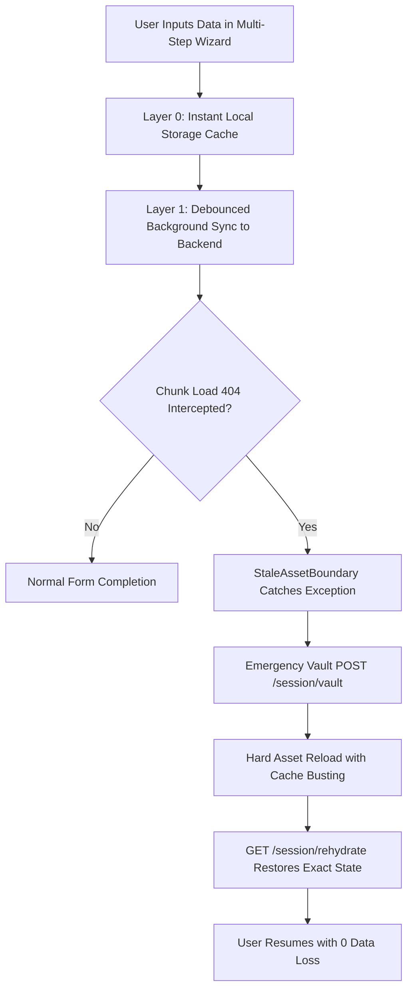

# 📋 01. Requirements Specification

This document defines the functional, non-functional, and compliance requirements for **Continuum Engine**.

---

## 1. Executive Summary & Problem Statement

Modern Single Page Applications (SPAs) and Progressive Web Apps (PWAs) rely on code-splitting (chunked JavaScript bundles). When a production release occurs, older chunk files on CDNs are invalidated or removed. Users with active sessions encounter `ChunkLoadError` / `404 Not Found` upon navigating to un-cached views or sub-flows.

### Traditional Impact:
- Hard crash with white screens or unhandled script errors.
- 100% loss of uncommitted form state, application data, or wizard progress.
- Severe friction, lost conversions, and increased support tickets in high-stakes workflows (banking, insurance, tax filing).

### The Continuum Solution:
Continuum Engine intercepts dynamic asset failure boundaries, vaults the in-flight micro-state instantly, triggers a background rehydration reload, and restores the user to their exact field and step with zero data loss.

---

## 2. Functional Requirements

### 2.1. Client Version Drift Detection
- **Requirement F-101:** Expose an ultra-lightweight endpoint `GET /api/v1/version/check` returning the active semantic server version (e.g., `1.0.1`).
- **Requirement F-102:** Inject `X-Continuum-Version` response headers across all HTTP API responses.
- **Requirement F-103:** Client-side background worker detects version drift between running client bundle and server version.

### 2.2. Error Interception & Telemetry
- **Requirement F-201:** `StaleAssetBoundary` must catch all uncaught exceptions matching regex `/ChunkLoadError|Loading chunk \d+ failed|404/`.
- **Requirement F-202:** Client logs chunk failure events to `POST /api/v1/telemetry/log` with URL, User-Agent, Session ID, and Stack Trace.
- **Requirement F-203:** Telemetry stream must be broadcast in real-time over WebSocket at `/api/v1/ws/telemetry`.

### 2.3. Micro-State Vaulting & Zero-Loss Rehydration
- **Requirement F-301:** Debounced local serialization (`500ms`) writes active form values to `localStorage`.
- **Requirement F-302:** Emergency vaulting `POST /api/v1/session/vault` transmits state snapshot within 300ms.
- **Requirement F-303:** Rehydration endpoint `GET /api/v1/session/rehydrate?session_id={id}` retrieves and validates encrypted payloads.
- **Requirement F-304:** Version migration transforms legacy field schema mappings without crashing the user interface.

---

## 3. Non-Functional Requirements (SLAs)

| Dimension | Metric / Target | Verification Method |
| :--- | :--- | :--- |
| **Data Safety** | **0 bytes uncommitted data lost** | Automated 404 Chaos simulation test |
| **Vault Latency** | **< 300ms at p99** | Asynchronous non-blocking I/O with Motor/Mock DB |
| **Availability** | **99.99% uptime** | Dockerized container with health check probes on `/api/v1/health` |
| **Security** | **AES-256 state encryption + JWT Auth** | Cryptographic payload verification and rate limiting (120 req/min) |
| **Accessibility** | **WCAG AAA Compliance** | Dual-theme high-contrast styling with ambient aurora visual comfort |

---

## 4. User Personas

1. **Applicant / End-User:** Completes financial applications without fear of session wipeouts or network dropout data losses.
2. **DevOps / Release Engineer:** Deploys continuous rolling releases to production without needing scheduled maintenance windows.
3. **Compliance & Security Auditor:** Inspects encrypted audit logs, TTL purge schedules, and tenant state isolation.
