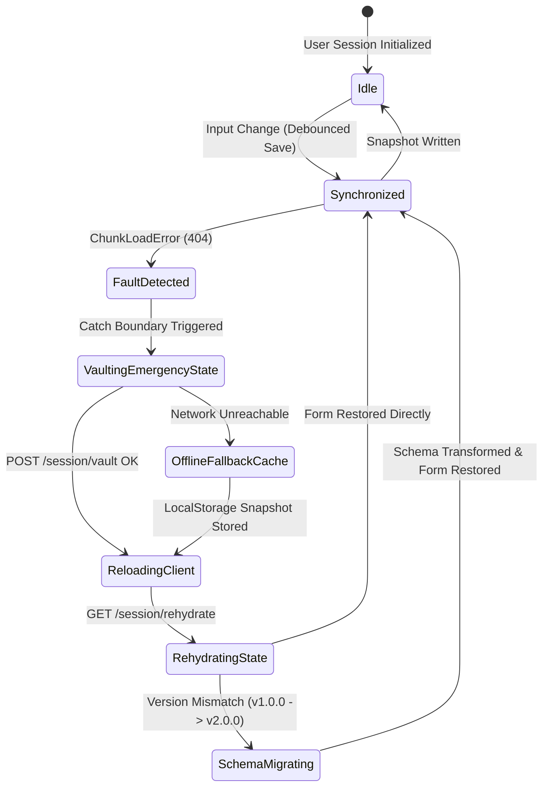

# 🏗️ 02. System Architecture & Resilience

This document details the multi-layered technical architecture, circuit breaker mechanisms, state machine lifecycles, and chaos engineering capabilities of **Continuum Engine**.

---

## 1. The 4-Layer Resilience Hierarchy

```
┌─────────────────────────────────────────────────────────────┐
│  LAYER 0: SURFACE LAYER (Local Persistence & Micro-Diff)    │
│  - Instant LocalStorage & SessionStorage mirrors            │
│  - Keystroke-level debounced serialization (500ms)          │
│  - Micro-diffing: only dirty fields serialized              │
├─────────────────────────────────────────────────────────────┤
│  LAYER 1: SIGNAL REFLEX (Edge Interception & Drift Check)   │
│  - Dynamic chunk error interception (StaleAssetBoundary)     │
│  - Periodic version drift poll & header verification        │
│  - Edge-level auto-buffering during network throttling      │
├─────────────────────────────────────────────────────────────┤
│  LAYER 2: CORE RESILIENCE (State Vault & Schema Migration)   │
│  - FastAPI asynchronous state vault endpoint                │
│  - AES-256 state payload encryption and schema validation    │
│  - Backward-compatible schema evolution transforms          │
├─────────────────────────────────────────────────────────────┤
│  LAYER 3: TELEMETRY MATRIX (Real-Time Observability & AI)   │
│  - High-frequency WebSocket telemetry heartbeat stream       │
│  - Live EKG waveform oscilloscope visualizer                │
│  - Embedded Gemini AI Diagnostic Underwriter                │
└─────────────────────────────────────────────────────────────┘
```

---

## 2. Circuit Breaker & Recovery State Machine



---

## 3. Schema Evolution & Migration Rules

When users transition across breaking schema changes (e.g. from `v1.0.0` with `fullName` to `v2.0.0` with `firstName` and `lastName`), Continuum Engine executes automated state transformation adapters:

```javascript
// Example schema transformation adapter
function migrateState(oldState, oldVersion, currentVersion) {
  const newState = { ...oldState };
  
  if (oldVersion === '1.0.0' && currentVersion >= '2.0.0') {
    if (newState.fullName && !newState.firstName) {
      const parts = newState.fullName.split(' ');
      newState.firstName = parts[0] || '';
      newState.lastName = parts.slice(1).join(' ') || '';
      delete newState.fullName;
    }
  }
  
  return newState;
}
```

---

## 4. Chaos Engineering & 404 Lab Simulator

Continuum Engine features an integrated **Chaos Lab** enabling real-time stress testing of failure modes:

1. **Simulate Chunk Load 404:** Intercepts runtime asset fetches, injects artificial HTTP 404 response, and validates that zero form inputs are lost.
2. **Simulate Schema Drift (v1.0.0 → v2.0.0):** Tests state rehydration across major version upgrades.
3. **Network Dropouts & Throttle:** Tests offline buffering in `localStorage` when backend connectivity is severed.
