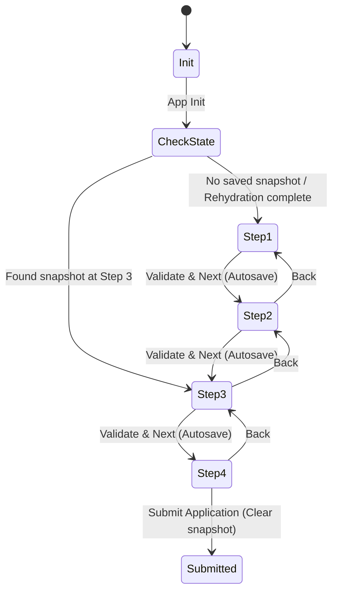

# Continuum Engine - UI/Pages Planning

This document details the layout design, screen wireframes, route configurations, wizard state machine, and error boundaries for the Flutter frontend of the Continuum Engine.

---

## 1. Flutter Screen Wireframes

The Flutter frontend application uses a clean, enterprise-grade card layout.

### 1.1. Main Wizard Container
- **Header:** 
  - Application title: **Continuum Engine - Loan Wizard**
  - Interactive stepper showing steps: `Personal Details` -> `Financial Info` -> `Loan Options` -> `Review & Submit`.
  - Active steps are highlighted; completed steps show checkmarks; pending steps are grayed out.
- **Body:**
  - A dynamic transition container displaying the current active step's form widget.
- **Bottom Navigation Bar:**
  - **Back Button:** Left-aligned, disabled on Step 1.
  - **Next/Submit Button:** Right-aligned, primary action color. Labels switch to "Submit" on Step 4.

### 1.2. Step Forms
- **Step 1: Personal Info**
  - Name Input (Text, with validations).
  - DOB Picker / Input (Validated format: YYYY-MM-DD).
  - Email (Text, email format validation).
  - Phone (Text, phone format validation).
  - SSN (Password-obscured text input for secure SSN/ID).
- **Step 2: Financial Details**
  - Employment Status (Dropdown select: Employed, Self-Employed, Unemployed, Retired).
  - Annual Income (Numeric text field with decimal support).
  - Monthly Debt (Numeric text field with decimal support).
- **Step 3: Loan Options**
  - Loan Amount (Numeric text field / Slider, limit $1,000 to $10,000,000).
  - Repayment Term (Dropdown: 12, 24, 36, 48, 60 months).
  - Loan Purpose (Dropdown: Debt Consolidation, Home Improvement, Business, Other).
- **Step 4: Review & Submit**
  - Structured summary card grouping inputted details by category (Personal, Financial, Loan).
  - Consent Checkbox: "I confirm the accuracy of the provided information."
  - "Submit Application" button.

### 1.3. Rehydration & Recovery Overlays
- **Restoring State Loader:**
  - Standardized overlay covering the page when rehydrating state.
  - Text: *"Rehydrating your application... please wait."*
  - Animated circular progress indicator.
- **Stale Asset Boundary Interception Overlay:**
  - Full-screen recovery view triggered when a 404 chunk error is caught.
  - Text: *"Application Update Detected. Syncing your inputs to the secure vault before updating..."*
  - Linear progress bar showing vault status, followed by automatic browser refresh.

---

## 2. Route Map & Route Guards

We use a declarative routing library (such as GoRouter or simple Navigator 2.0 pattern).

```
/
├── /login                   (User login for Telemetry Dashboard)
├── /dashboard               (Admin Telemetry Dashboard)
└── /apply                   (Form Wizard entry point)
    ├── ?session_token=...   (Optional query parameter for state recovery/deep link)
```

### 2.1. Route Configuration
- `/apply`: Main application entry point. When initialized:
  1. Checks for existing local/offline session snapshots.
  2. If a local session snapshot exists, queries the backend rehydrate endpoint to verify state freshness.
  3. Rehydrates the wizard state and directs the user to the correct step index.
- `/dashboard`: Restrict access via auth guard checking JWT validity.

---

## 3. Step Wizard Flow State Machine

The Wizard uses a state management controller (e.g., BLoC, Riverpod, or ChangeNotifier) executing the following state transition flow:



### 3.1. Autosave Triggers
- **Debounced Input Changes:** On every keystroke/change in any form input field, wait 500ms and write state to local persistent storage.
- **Step Transition:** Writing immediately to both local offline storage and backend state cache on transition clicks ("Next", "Back").

---

## 4. Error Boundaries (`StaleAssetBoundary`)

The `StaleAssetBoundary` is a Flutter widget that wraps the main wizard routes.

### 4.1. Error Interception Strategy
- On Web, Flutter dynamically compiles sections of code into separate `.part.js` (chunk) assets. When a page transition or dialog requires a chunk that is no longer present on the server, the browser throws an HTTP 404 NetworkError.
- The `StaleAssetBoundary` catches these uncaught exceptions in its `onError` / error handling loop.
- It filters errors matching script asset loading errors (e.g., containing `.part.js` or matching chunk patterns).

### 4.2. Recovery Actions
1. **Freeze UI:** Render the dynamic overlay showing recovery instructions.
2. **Collect State:** Immediately extract the full current form wizard state (all values + current step index).
3. **Vault State:** Submit an asynchronous POST request to the `/session/vault` endpoint containing the session data.
4. **Cache Locally:** Save the data to Hive / SharedPreferences as an offline fallback.
5. **Report Telemetry:** Send a log event to `/telemetry/log` specifying `404_chunk_load_failed` alongside metadata.
6. **Hard Reload:** Trigger browser page refresh:
   ```dart
   import 'dart:html' as html;
   html.window.location.reload(true);
   ```
