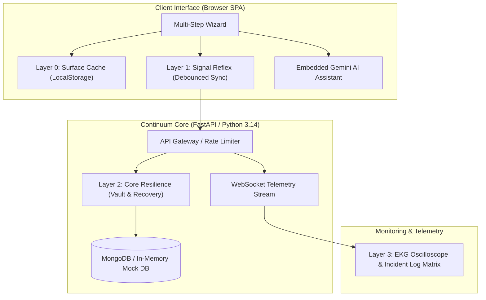

# 📚 Continuum Engine — System Documentation Portal

Welcome to the official technical documentation for **Continuum Engine**, the production-grade state persistence, zero-data-loss recovery, and real-time telemetry platform.

---

## 📑 Documentation Structure

| Document | Topic | Summary |
| :--- | :--- | :--- |
| **[01. Requirements Specification](file:///c:/unstop%20hackathon/docs/01_requirements_specification.md)** | Functional & Non-Functional Requirements | System goals, user personas, SLA targets, and multi-step transaction specifications. |
| **[02. System Architecture & Resilience](file:///c:/unstop%20hackathon/docs/02_system_architecture_and_resilience.md)** | 4-Layer Architecture & Recovery | Surface, Signal Reflex, Core Resilience, and Telemetry layers; Circuit Breakers and Chaos Lab. |
| **[03. Database & Telemetry Schema](file:///c:/unstop%20hackathon/docs/03_database_and_telemetry_schema.md)** | MongoDB & WebSocket Schemas | Document structures for `session_snapshots`, `telemetry_logs`, TTL auto-purging, and WebSocket feeds. |
| **[04. API Reference & Contracts](file:///c:/unstop%20hackathon/docs/04_api_reference_and_contracts.md)** | REST & WebSocket API Specs | Full endpoint catalog, request/response models, auth headers, rate limiting, and curl examples. |
| **[05. UI/UX Design & Dual-Theme](file:///c:/unstop%20hackathon/docs/05_ui_ux_design_and_dual_theme.md)** | Design System & Ergonomics | Ambient Aurora Canvas 2D engine, WCAG AAA Light/Dark modes, mobile layouts, and Gemini AI Drawer. |
| **[06. Deployment & Operations](file:///c:/unstop%20hackathon/docs/06_deployment_and_operations.md)** | Docker, Render & Runbooks | Containerization specs, zero-downtime rolling releases, health probes, and disaster recovery. |

---

## ⚡ Quick Architecture Overview



---

## 🛠️ Quick Local Setup

### 1. Backend Server
```bash
# Install dependencies
pip install -r backend/requirements.txt

# Start FastAPI server
python -m uvicorn backend.app.main:app --host 127.0.0.1 --port 8000 --reload
```

### 2. Access the Application
- **Main Quantum Interface:** `http://127.0.0.1:8000/`
- **Interactive Swagger Docs:** `http://127.0.0.1:8000/docs`
- **OpenAPI JSON Spec:** `http://127.0.0.1:8000/openapi.json`

### 3. Run Test Suite
```bash
python -m pytest backend/tests/
```
